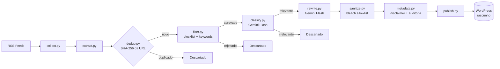

# Pílula Laranja - Automação de Notícias


Pipeline de automação em Python que coleta, filtra, reescreve e publica notícias sobre Bitcoin como **rascunhos** no WordPress, para o projeto "Pílula Laranja".

> **Importante:** este projeto não substitui curadoria editorial humana. Toda saída é publicada como rascunho, nada vai ao ar sem revisão manual.

---

## Sumário

- [O que é e por que existe](#o-que-é-e-por-que-existe)
- [Arquitetura](#arquitetura)
- [Stack](#stack)
- [Como rodar localmente](#como-rodar-localmente)
- [Decisões técnicas relevantes](#decisões-técnicas-relevantes)
- [Segurança](#segurança)
- [Roadmap e status](#roadmap-e-status)
- [Licença](#licença)

---

## O que é e por que existe

O site Pílula Laranja depende de garimpo manual de notícias em fontes internacionais, tradução, adaptação para PT-BR e publicação. Resultando em um processo repetitivo que consome tempo que poderia ser investido em curadoria e análise.

Este projeto automatiza a parte mecânica do processo:

1. Coleta artigos de fontes RSS confiáveis sobre Bitcoin.
2. Filtra conteúdo irrelevante ou fora do escopo editorial (memecoins, especulação, pump-and-dump) em duas camadas; uma determinística, uma semântica via LLM.
3. Reescreve os artigos aprovados em português brasileiro, adaptando a linguagem em vez de traduzir literalmente.
4. Sanitiza o HTML gerado e publica como **rascunho** no WordPress, com metadados de rastreabilidade.

Todo o pipeline roda de forma agendada via GitHub Actions, sem servidor dedicado, com estado mínimo persistido em um banco Turso (LibSQL).

---

## Arquitetura

### Pipeline de dados

O pipeline é **stateless**: cada execução do comando `filter` roda todas as etapas de coleta e filtragem em uma única run, em memória, sem persistir estado intermediário entre etapas. Apenas o resultado final (hash de deduplicação, URL e uso de API) é gravado no Turso.



### Agendamento

A reescrita (etapa que mais consome quota do Gemini) é distribuída entre dois modelos, cada um rodando duas vezes ao dia, totalizando 4 runs diárias.

```mermaid
gantt
    dateFormat  HH:mm
    axisFormat  %H:%M
    section Modelo A
    Run 1 (10h BRT) :a1, 10:00, 30m
    Run 2 (18h BRT) :a2, 18:00, 30m
    section Modelo B
    Run 1 (14h BRT) :b1, 14:00, 30m
    Run 2 (22h BRT) :b2, 22:00, 30m
    section Manutenção
    Cleanup TTL (01h BRT) :c1, 01:00, 15m
    Validação de fontes RSS (segunda, 06h BRT) :c2, 06:00, 15m
```



Cada workflow (`collect_and_publish_a`, `collect_and_publish_b`) roda o pipeline completo (`collect → extract → dedup → filter → classify → rewrite → publish`) até um limite de itens por run, evitando estourar a quota diária (RPD) do modelo Gemini correspondente.

---

## Stack

| Camada | Tecnologia | Por quê |
|---|---|---|
| Linguagem | Python 3.12 | Ecossistema maduro para automação, tipagem estática via `typing` |
| Gerenciador de pacotes | `uv` | Resolução de dependências e ambientes virtuais mais rápidos que `pip`/`venv` |
| Validação de dados | Pydantic | Falha rápido e explícito (`ValidationError`) em vez de erros silenciosos com dados malformados |
| Banco de dados | Turso (LibSQL) via HTTP API | Serverless, free tier suficiente para o volume do projeto, sem necessidade de gerenciar conexão persistente |
| LLM | Gemini API (free tier) | Free tier com quota suficiente para o volume do MVP; dois modelos usados em paralelo para dobrar a capacidade de reescrita diária |
| Coleta RSS | `feedparser` | Biblioteca padrão de fato para parsing de RSS/Atom em Python |
| Extração de conteúdo | `trafilatura` + `readability-lxml` (fallback) | `trafilatura` cobre a maioria dos casos; `readability` evita descarte de artigos em sites com HTML menos convencional |
| Sanitização HTML | `bleach` | Allowlist de tags; bloqueia o desconhecido por padrão, mais seguro que blocklist |
| Publicação | WordPress REST API + App Password | Autenticação sem expor a senha principal da conta; role `Author` restringe escopo |
| CLI | Typer | Type hints nativos, integração natural com Pydantic |
| Retry/resiliência | `tenacity` | Backoff exponencial configurável para chamadas HTTP e ao Gemini |
| Logging | `structlog` | Logs estruturados em campos (kwargs), não strings interpoladas |
| Testes | `pytest` + `pytest-mock` | Mocks isolam rede e dependências externas em todos os testes |
| Orquestração | GitHub Actions | Cron + workflow_dispatch, sem custo de infraestrutura dedicada |
| Lint/format | Ruff | Único binário para lint e formatação, substitui `flake8` + `black` |

---

## Como rodar localmente

### Pré-requisitos

- Python 3.12+
- [`uv`](https://docs.astral.sh/uv/) instalado
- Conta no [Turso](https://turso.tech/) com um banco criado
- Chave de API do [Google AI Studio](https://aistudio.google.com/) (Gemini)
- WordPress com um usuário `Author` e uma [Application Password](https://wordpress.org/documentation/article/application-passwords/) gerada

### Setup

```bash
git clone https://github.com/json-jaelson-junior/automacao-pilula-laranja.git
cd automacao-pilula-laranja

uv sync

cp .env.example .env
# Preencha .env com suas credenciais (Turso, Gemini, WordPress)

uv run python scripts/run_migrations.py
```

### Comandos da CLI

```bash
# Valida se todas as fontes RSS configuradas estão acessíveis
uv run python scripts/validate_sources.py

# Roda apenas collect -> extract -> dedup -> filter (sem custo de API, sem gravar no WordPress)
uv run pilula filter --dry-run

# Roda o pipeline completo de filtragem, incluindo classify (com API Gemini e Turso)
uv run pilula filter

# Roda o pipeline completo, incluindo reescrita e publicação de rascunhos
uv run pilula publish

# Remove registros expirados do Turso (TTL)
uv run pilula cleanup --dry-run
uv run pilula cleanup
```

### Testes

```bash
uv run pytest
uv run ruff check .
uv run ruff format --check .
```

---

## Decisões técnicas relevantes

Decisões abaixo com maior impacto arquitetural; o histórico completo está no [CHANGELOG.md](CHANGELOG.md) e no log de commits.

- **Pipeline stateless (in-memory):** o comando `filter` executa `collect -> extract -> dedup -> filter -> classify` numa única run, sem persistir estado intermediário entre etapas. Justificativa: volume baixo no MVP não justifica a complexidade de checkpoints ou retry granular por etapa.

- **Deduplicação por SHA-256 da URL, não do conteúdo:** a URL é o identificador canônico de um artigo. O conteúdo pode ser editado pela fonte original após publicação; a URL não muda. Evita reprocessar o mesmo artigo em runs diferentes. A revisão humana dos rascunhos gerados é necessária para evitar qualquer alteração feita na URL da fonte.

- **Duas camadas de filtragem antes da reescrita:** um filtro local determinístico (blocklist + keywords obrigatórias) roda antes do classificador semântico via Gemini. Rejeição determinística é gratuita e auditável pelo termo exato que causou a rejeição; a chamada ao LLM só acontece para itens que já passaram no filtro barato, economizando quota.

- **Separador `---SEO---` como contrato de parse, em vez de JSON:** o Gemini formata JSON de forma inconsistente em respostas longas contendo HTML (escapes quebrados, blocos de código markdown ao redor do JSON). Um separador de texto simples é determinístico e fácil de depurar visualmente. `rewrite.py` faz `split("---SEO---", maxsplit=1)` para isolar o excerpt do body.

- **`bleach` com allowlist e `strip=True`:** allowlist é mais segura que blocklist por padrão, pois bloqueia qualquer tag desconhecida em vez de tentar prever e bloquear tags perigosas uma a uma. `strip=True` remove a tag mas preserva o texto interno, evitando perda de conteúdo editorial.

- **`Retrying` do `tenacity` como context manager em métodos de classe:** o decorator `@retry` não tem acesso ao `self` no momento em que a classe é definida. Padrão adotado: decorator (`@http_retry()`) em funções standalone (`wordpress.py`); `Retrying` como context manager em métodos de instância (`gemini.py`), onde o retry envolve apenas parte de um método maior.

- **Dois modelos Gemini para reescrita, um único para classificação:** a etapa de reescrita é a que mais consome quota (RPD baixo, texto de saída longo). Dividir a reescrita entre dois modelos, cada um rodando duas vezes ao dia, dobra a capacidade diária efetiva sem exigir tier pago. A classificação usa um modelo com RPD mais alto e resposta curta (SIM/NÃO), onde uma única instância já é suficiente para o volume atual.

- **Timeout de 150s no cliente Gemini:** ajustado incrementalmente (30s -> 90s -> 150s) conforme o prompt de reescrita ficou mais elaborado e passou a exigir respostas mais longas. Timeout insuficiente causava `DEADLINE_EXCEEDED` mesmo em chamadas que eventualmente teriam sucesso.

- **Round-robin entre fontes antes do corte por `max_items`:** sem essa etapa, o corte de itens para reescrita seguia a ordem das fontes no `sources.yaml`, favorecendo desproporcionalmente a primeira fonte da lista quando havia mais itens aprovados do que a quota permitia reescrever.

- **`config/` e `prompts/` versionados em Git, não ignorados:** apesar de conterem detalhes editoriais sensíveis (keywords, blocklist, prompt de reescrita), mantê-los versionados garante reprodutibilidade e auditoria do comportamento do pipeline ao longo do tempo.

---

## Segurança

- Credenciais (Turso, Gemini, WordPress) nunca hardcoded, apenas via variáveis de ambiente / GitHub Secrets.
- WordPress App Password associado a um usuário com role `Author`, escopo mínimo necessário para criar rascunhos.
- `gitleaks` ativo em pre-commit e CI, prevenindo commit acidental de segredos.
- Actions de terceiros (`actions/checkout`, `astral-sh/setup-uv`) pinadas por commit SHA, não por tag mutável.
- Sanitização de HTML via `bleach` com allowlist restrita, rejeitando ativamente `script`, `iframe`, atributos `on*` e URLs `javascript:`.
- Todo conteúdo gerado é publicado como **rascunho** (nunca `publish` direto), a revisão humana é necessária antes de qualquer conteúdo ir ao ar.

Política de reporte de vulnerabilidades: [SECURITY.md](SECURITY.md).

---

## Roadmap e status

| Fase | Descrição | Status |
|---|---|---|
| 0 | Setup (contas, repositório, ambiente, estrutura) | Concluída |
| 1 | Coleta & Persistência (RSS, extração, deduplicação) | Concluída |
| 2 | Filtragem local + classificação semântica | Concluída |
| 3 | Reescrita, sanitização e publicação (MVP) | Concluída |
| 4 | CI/CD (GitHub Actions, Dependabot, testes em PR) | Concluída |
| 5 | Observabilidade (`structlog` padronizado) | Concluída |
| 6 | Polimento & Release v0.1.0 (README, CHANGELOG, tag) | Concluída |

Fora de escopo para o MVP: artigos longos, digests técnicos, verticais além de Bitcoin (planejadas como configuração YAML adicional, sem mudança de código).

Histórico detalhado de mudanças: [CHANGELOG.md](CHANGELOG.md).

---

## Licença

MIT - veja [LICENSE](LICENSE).
